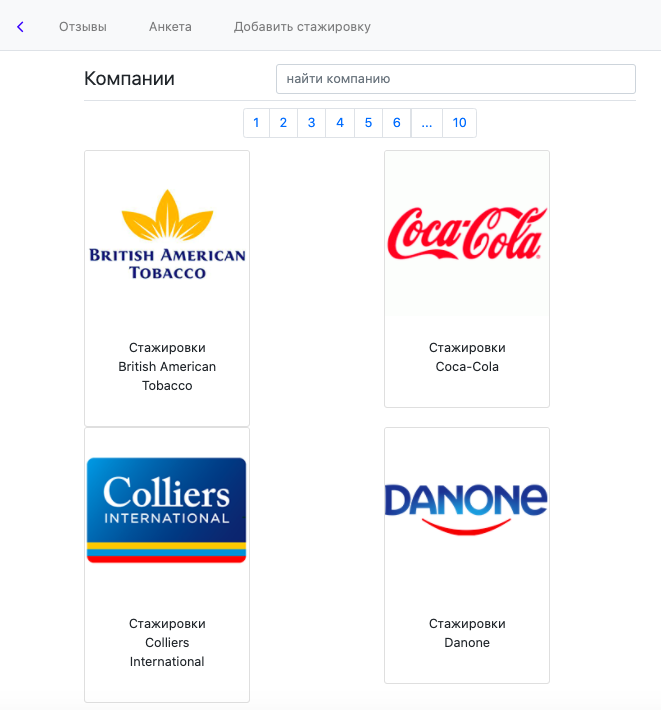
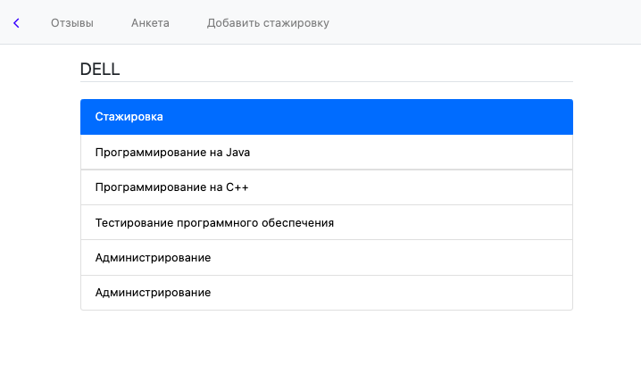
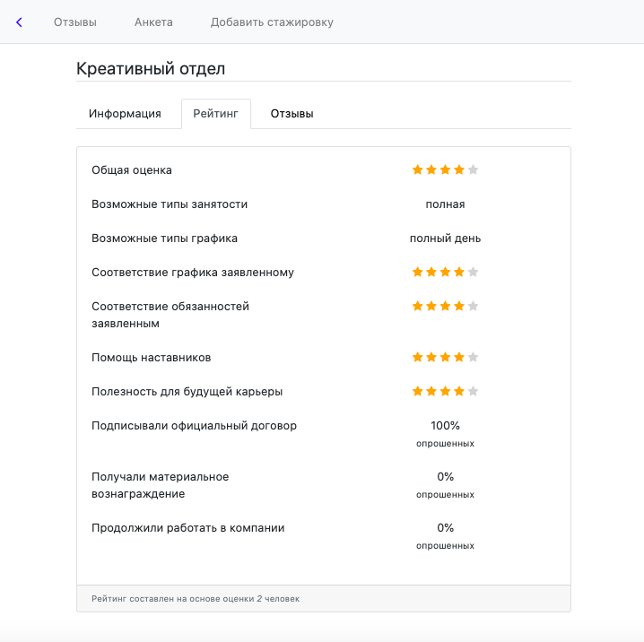
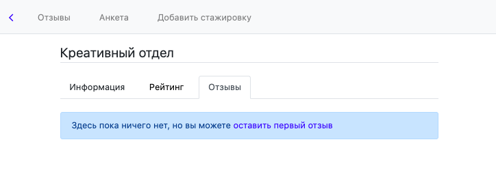
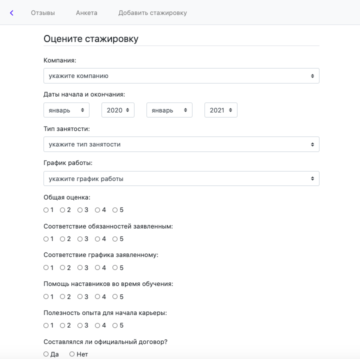
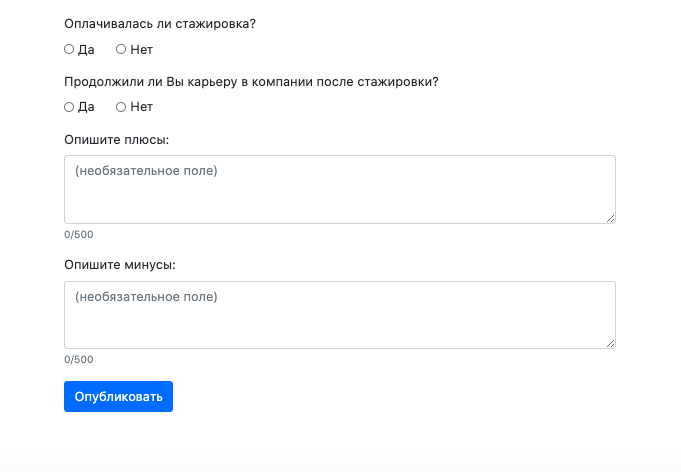

# Отзывы на стажировки - IntSights

Язык: python 3, javascript, html + css

Проект, созданный в рамках предмета Проектный семинар. Сайт для сбора и публикации отзывов студентов и выпускников на стажировки различных компаний.

### Интерфейс

Основной экран

Отделы внутри компании

Общий рейтинг

Текстовые отзывы

Анкета

